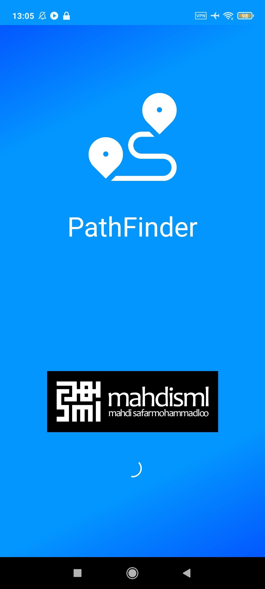
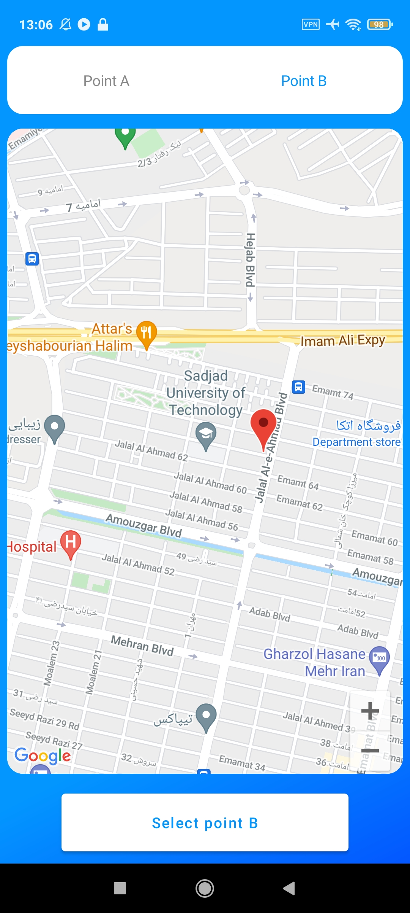
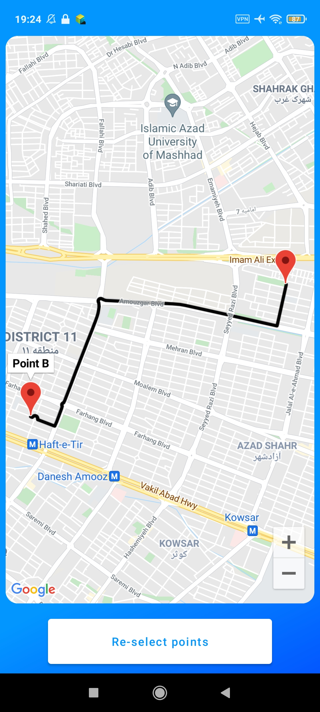
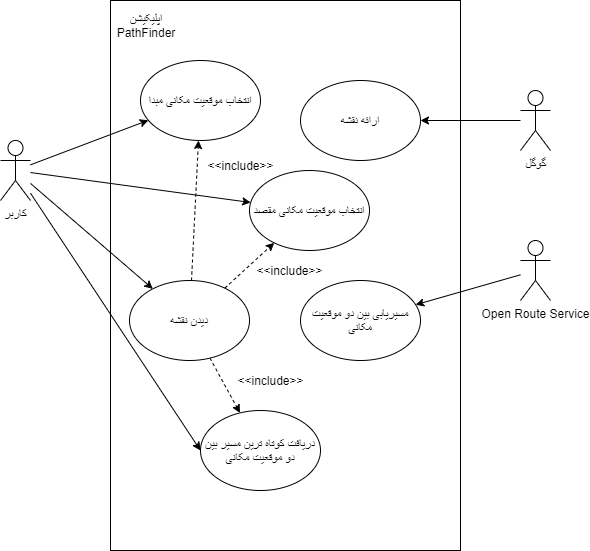
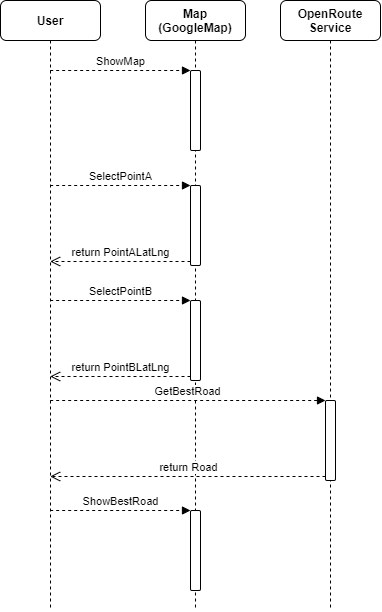
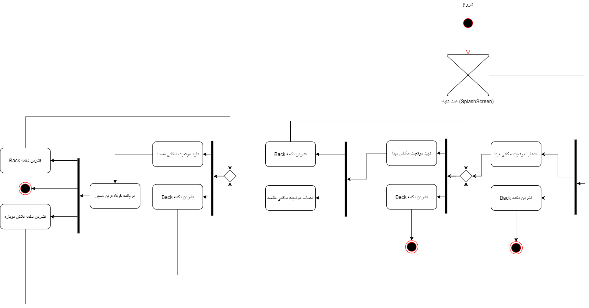
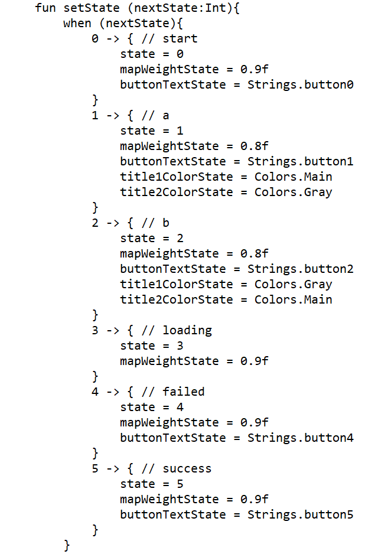
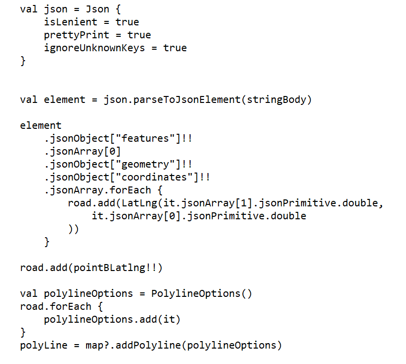

# SmlPathFinder
an Android App (a university project)

Technologies :

Jetpack Compose,
Kotin,
Kotlin Coroutine,
Kotlinx Serialization,
Ktor,
Open Route Service (api),
Google Maps (map),
Material Design

Screenshots :

  
  
  

technical sheets :

  
  
  
  
  

